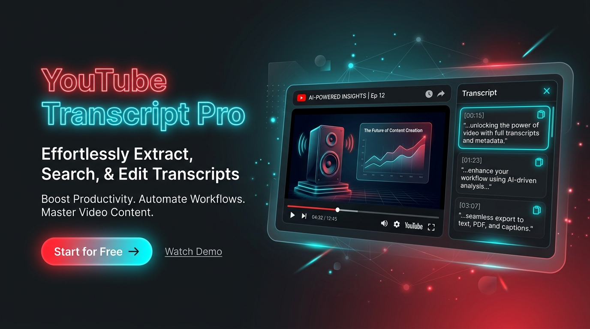
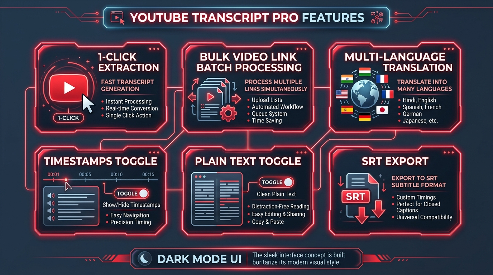
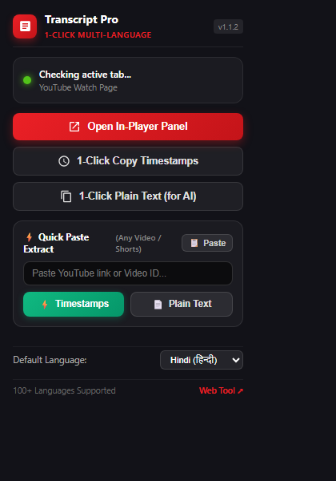
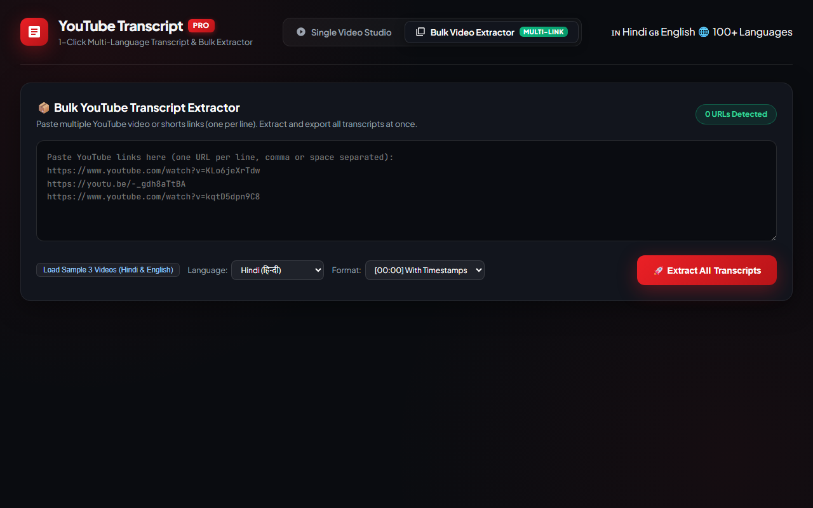
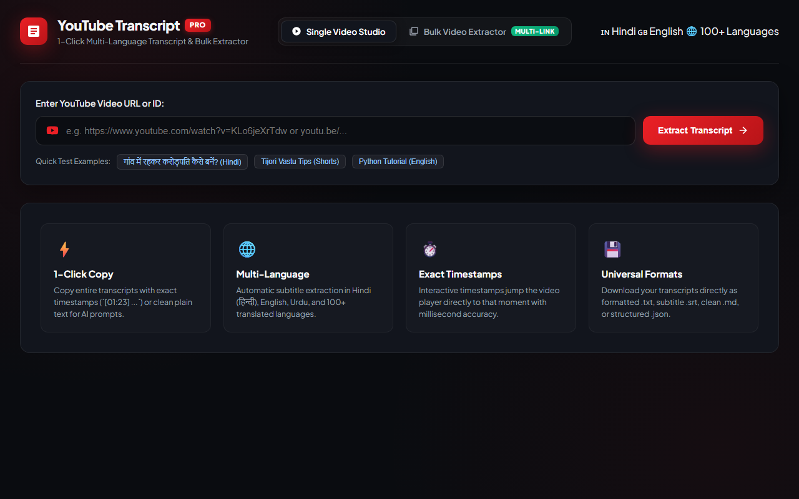
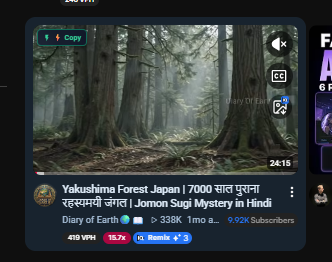

<div align="center">



# 🎬 YouTube Transcript Pro (v1.1.2)
### ⚡ 1-Click Multi-Language YouTube Transcript & Bulk Video Extractor

[](https://github.com/mohdkhan837218-spec/youtube-transcript-pro)
[](manifest.json)
[](LICENSE)
[](package.json)
[](#-multi-language-support)

**Extract complete YouTube transcripts in Hindi, English, and 100+ languages in a single click — with exact timestamps or clean plain text, right on YouTube or in batch mode!**

[Features](#-key-features) • [Screenshots](#-visual-showcase) • [Installation](#-installation-guide) • [Bulk Extractor](#-bulk-video-link-extractor) • [Hindi Guide](README_HINDI.md)

</div>

---

## 🌟 Overview

**YouTube Transcript Pro** is a modern, privacy-friendly Chrome Extension (Manifest V3) and standalone Web Studio designed for content creators, researchers, students, and professionals. It provides lightning-fast transcript extraction directly on YouTube video pages, thumbnail feeds, extension popup, and via a batch bulk processing dashboard.

---

## 🚀 Key Features



- **⚡ 1-Click Instant Extraction**:
  - Get full transcripts without opening third-party websites or complex menus.
  - YouTube player action bar integration & drawer.
- **🏷️ Native Thumbnail `[CC Transcript]` Badge**:
  - Browse YouTube home/search feeds and copy transcripts directly from video thumbnails.
  - **Normal Click**: Copies formatted with exact timestamps `[00:15]`.
  - **Shift + Click**: Copies pure clean plain text with no timestamps.
- **🕒 Timestamps vs 📄 Plain Text Dual Mode**:
  - Dedicated buttons for timestamps or clean reading/AI prompt ready text.
- **📦 Multi-Link Bulk Extractor**:
  - Paste 10, 20, or 50+ YouTube links at once.
  - Batch extraction with live progress bar and individual/combined TXT and JSON export.
- **🌐 100+ Languages Supported**:
  - Full native support for Hindi (हिन्दी), English, Urdu, Spanish, French, German, Japanese, and more.
  - Automatic translation fallback powered by Google Translate API.
- **🛡️ 4-Tier Resilient Engine**:
  - Tier 1: High-speed Local Express Server (`youtube-transcript`)
  - Tier 2: Chrome Extension Background Service Worker
  - Tier 3: YouTube Android InnerTube API with mobile client headers
  - Tier 4: Direct Web scraping fallback
- **💾 Export Formats**:
  - Plain Text (`.txt`), Structured (`.json`), and Subtitles (`.srt`) with millisecond timecodes.

---

## 📸 Visual Showcase

<div align="center">

### 1. Extension Popup & Quick Paste Extractor
*Instant extraction with thumbnail preview, title, line counts, and 1-click clipboard paste.*



---

### 2. Web Studio & Bulk Extractor (Multi-Link)
*Extract dozens of YouTube videos in parallel with batch progress tracking.*



---

### 3. Single Video Studio Workspace
*Interactive synchronized player, real-time search, word count, and export tools.*



---

### 4. YouTube Feed Thumbnail `[CC Transcript]` Badge
*Hover over any video thumbnail on YouTube to instantly copy transcripts.*



</div>

---

## 📥 Installation Guide

### Option A: Install Chrome Extension (Manifest V3)

1. Clone or download this repository:
   ```bash
   git clone https://github.com/mohdkhan837218-spec/youtube-transcript-pro.git
   ```
2. Open Google Chrome and go to `chrome://extensions/`.
3. Enable **Developer mode** toggle in the top-right corner.
4. Click **Load unpacked** in the top-left corner.
5. Select the `youtube-transcript-pro` root folder.
6. The extension icon will now appear in your browser toolbar! 🎉

---

### Option B: Run the Web Studio & Local API Server

You can also run the full-featured Web Studio locally on your computer:

1. Open your terminal in the project directory:
   ```bash
   cd youtube-transcript-pro
   npm install
   ```
2. Start the local server:
   ```bash
   npm start
   ```
3. Open your browser and navigate to:
   ```
   http://localhost:3000
   ```
4. Access both the **Single Video Studio** and **Bulk Video Extractor** tabs!

---

## 🛠️ Project Structure

```text
youtube-transcript-pro/
├── assets/                       # High-res graphics, banners, and screenshots
│   ├── banner.jpg                # GitHub hero banner
│   ├── features_showcase.jpg     # Infographic of features
│   ├── extension_popup.png       # Popup UI screenshot
│   ├── web_studio_bulk.png       # Bulk Extractor screenshot
│   ├── web_studio_single.png     # Single Studio screenshot
│   └── youtube_hover_badge.png   # YouTube thumbnail badge preview
├── background/
│   └── service-worker.js         # Manifest V3 service worker & fallback fetcher
├── content/
│   ├── content.js                # In-page UI, YouTube action bar, CC thumbnail badge
│   ├── content.css               # Modern dark-mode styling & animations
│   └── page-world.js             # YouTube player context communicator
├── icons/                        # Extension icons (16px, 48px, 128px)
├── popup/
│   ├── popup.html                # Extension quick paste popup UI
│   ├── popup.css                 # Glassmorphic dark styling
│   └── popup.js                  # Quick extraction logic & clipboard handler
├── web-dashboard/                # Standalone Web Studio
│   ├── index.html                # Studio & Bulk Extractor HTML
│   ├── style.css                 # Dark neo-brutalist / cyber-clean CSS
│   └── app.js                    # Bulk extraction & single studio controller
├── manifest.json                 # Chrome Extension Manifest V3 configuration
├── package.json                  # Node.js project & dependencies
├── server.js                     # Express API server with multi-tier transcript engine
├── README_HINDI.md               # Complete documentation in Hindi
└── README.md                     # Main documentation & visual showcase
```

---

## 💡 How to Use

### 1. Directly on YouTube
- While watching any video, click the **"⚡ Transcript"** button located right below the video player.
- The transcript drawer will slide out showing synchronized text and timestamps.
- Use **"Copy Timestamps"** or **"Copy Plain Text"** to copy.

### 2. From YouTube Home / Subscriptions / Search Feed
- Hover over any video thumbnail.
- A neat dark frosted glass badge **`[CC Transcript]`** will appear at the top-left of the thumbnail.
- **Click**: Copies complete transcript with `[MM:SS]` timestamps.
- **Shift + Click**: Copies clean plain text.

### 3. Quick Paste in Extension Popup
- Click the extension icon in your Chrome toolbar.
- Click **"📋 Paste"** or enter any YouTube URL / Short.
- Choose **"⚡ Timestamps"** or **"📄 Plain Text"**.
- Transcript is copied to your clipboard instantly with live preview!

### 4. Bulk Video Extractor
- Open `http://localhost:3000` or click **"Web Tool ↗"** in popup.
- Select the **Bulk Video Extractor** tab.
- Paste multiple YouTube URLs (one per line).
- Select language and format, then click **"🚀 Extract All Transcripts"**.
- Export as single combined `.txt` or `.json` file!

---

## 📜 License

This project is open-source and licensed under the [MIT License](LICENSE).

---

<div align="center">
  <sub>Built with ❤️ by mohdkhan837218-spec</sub>
</div>
